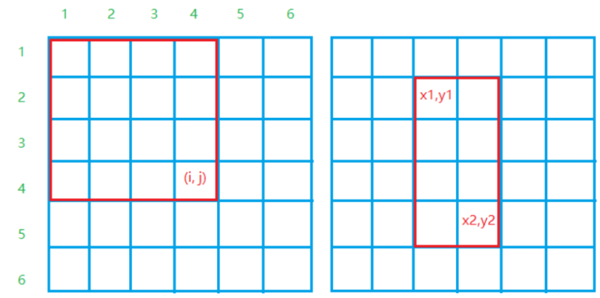
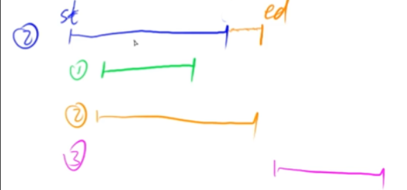

* [基础算法](#基础算法)
   * [快速排序](#快速排序)
   * [归并排序](#归并排序)
      * [逆序对的数量](#逆序对的数量)
   * [二分法](#二分法)
      * [浮点数二分](#浮点数二分)
   * [高精度](#高精度)
      * [a+b](#ab)
      * [a-b](#a-b)
      * [a*b](#ab-1)
      * [a/b](#ab-2)
   * [位运算](#位运算)
   * [前缀和](#前缀和)
     * [前缀和](#前缀和-1)
     * [前缀矩阵和](#前缀矩阵和)
     * [一维差分](#一维差分前缀和的逆运算)
     * [二维差分](#二维差分)
   * [双指针](#双指针)
   * [离散化](#离散化)
   * [区间合并](#区间合并)

# 基础算法

## 快速排序

**代码思想**：

1. 选定一个数
2. 将所有比该数小的放左边
3. 将所有比该数大的放右边
4. 重复1~3过程

~~~cpp
void quick_sort(int a[], int l, int r){
    if(l >= r) return;
    
    int x = a[l], i = l - 1, j = r + 1;
    
    while(i < j){
        do i ++; while(a[i] < x);
        do j --; while(a[j] > x);
        if(i < j) swap(a[i], a[j]);
    }
    quick_sort(a, l, j);
    quick_sort(a, j + 1, r);
}
~~~

## 归并排序

**算法思想**

1. [L,R]=>[L,mid],[mid+1,R]
2. 递归排序[L,mid]和[mid+1,R]
3. 归并，将左右两个序列合并成一个有序序列

~~~cpp
void merge_sort(int q[], int l, int r){

    //递归终止
    if(l >= r) return;
    
    //分成子问题
    int mid = l + r >> 1;//二分
    
    //递归处理子问题
    merge_sort(q, l, mid);//左半段
    merge_sort(q, mid + 1, r);//右半段
    
    //合并子问题
    int k = 0, i = l, j = mid + 1;
    while(i <= mid && j <= r)
        if(q[i] <= q[j]) temp[k ++] = q[i ++];
        else temp[k ++] = q[j ++];
    while(i <= mid) temp[k ++] = q[i ++];
    while(j <= r) temp[k ++] = q[j ++];
    
    for(int i = l, j = 0; i <= r; i ++, j ++) q[i] = temp[j];
}
~~~

### 逆序对的数量

1. [L,R]=>[L,mid],[mid+1,R]
2. 递归排序[L,mid]和[mid+1,R]
3. 归并，将左右两个序列合并成一个有序序列

上面是归并过程

1. 左半边内的逆序对数量为merge_sort(L,mid)
2. 右半边内的逆序对数量为merge_sort(mid+1,R)
3. 当a[i] > a[j]：res += mid - i + 1;

~~~cpp
LL merge_sort(int l, int r)
{
    if(l >= r) return 0;
    
    int mid = l + r >> 1;
    
    LL res = merge_sort(l, mid) + merge_sort(mid + 1, r);
    
    int k = 0, i = l, j = mid + 1;
    while(i <= mid && j <= r)
        if(a[i] <= a[j]) temp[k ++] = a[i ++];
        else{
            temp[k ++] = a[j ++];
            res += mid - i + 1;
        }
    while(i <= mid) temp[k ++] = a[i ++];
    while(j <= r) temp[k ++] = a[j ++];
    
    for(int i = l, j = 0; i <= r; i ++, j ++) a[i] = temp[j];
    
    return res;
}
~~~

## 二分法

有单调性一定可以二分，二分不一定需要单调性

**本质：**

**一般满足，一半不满足，寻找边界在哪一边**

**整数二分是求红色范围的右端点 或者 绿色范围的左端点**

1. 红色范围的右端点

   mid = ( l + r )/ 2

   if(check(mid))——>true——>[l,mid]：r=mid

   ​						——>false——>[mid+1,r]：l = mid+1

~~~cpp
int bsearch(int l, int r)
{
    while(l < r)
    {
        int mid = l + r >> 1;
        if(check(mid)) r = mid;
        else l = mid + 1;
    }
    return l;
}
~~~

2. 绿色范围的左端点

   mid = ( l + r + 1)/ 2

   if(check(mid))——>true——>[mid,r]：l = mid

   ​						——>false——>[l,mid-1]：r=mid-1

~~~cpp
int bsearch(int l, int r)
{
    while(l < r)
    {
        int mid = l + r + 1 >> 1;
        if(check(mid)) r = mid - 1;
        else l = mid;
    }
    return l;
}
~~~

### 浮点数二分

~~~cpp
while(r - l > 1e-8){
    double mid = (l + r) / 2;
    if(mid >= x) r = mid;
    else l = mid;
}
~~~

## 高精度

### a+b

**思路**

1. 大整数的存储：从后往前存(四种存储运算一致)

2. 模拟计算过程

**核心代码**

~~~cpp
vector<int> add(vector<int> &A, vector<int> &B)
{
    vector<int> C;
    int t = 0;
    for(int i = 0; i < A.size() || i < B.size(); i ++)
    {
        if(i < A.size()) t += A[i];
        if(i < B.size()) t += B[i];
        C.push_back(t % 10);
        t /=10;
    }
    if(t) C.push_back(1);
    return C;
}
~~~

### a-b

**思路**

1. 首先确保a ≥ b，如果a < b，交换位置

   如果a ≥ b : a-b

   否则a < b : - (b - a)

2. 接着进行相减操作

   ai - bi - t ≥ 0 : ai - bi = t

   ai - bi < 0 : ai + bi + 10 - t

**核心代码**

1. 比较cmp

   ~~~cpp
   bool cmp(vector<int>& a, vector<int>& b)
   {
       if(a.size()!=b.size()) return a.size()>b.size();
       for(int i=a.size()-1;i>=0;i--){//最高位不相等
           if(a[i]!=b[i]) return a[i]>b[i];
       }
       return true;
   }
   ~~~

2. 相减sub

~~~cpp
vector<int> sub(vector<int> &A, vector<int> &B)
{
    vector<int> C;
    for (int i = 0, t = 0; i < A.size(); i ++ )
    {
        t = A[i] - t;
        if (i < B.size()) t -= B[i];
        C.push_back((t + 10) % 10);
        if (t < 0) t = 1;
        else t = 0;
    }

    while (C.size() > 1 && C.back() == 0) C.pop_back();
    return C;
}
~~~

### a*b

**核心代码**

~~~cpp
vector<int> mul(vector<int> &A, int b)
{
    vector<int> C;
    int t = 0;//进位
    
    for(int i = 0; i < A.size() || t; i ++)
    {
        if(i < A.size()) t += A[i] * b;
        C.push_back(t % 10);
        t /= 10;
    }
    while(C.size() > 1 && C.back() == 0) C.pop_back();
    return C;
}
~~~

### a/b

**核心代码**

~~~cpp
vector<int> div(vector<int> &A, int b, int &r)
{
    vector<int> C;
    r = 0;
    for(int i = A.size() - 1; i >= 0; i --){
        r = r * 10 + A[i];
        C.push_back(r / b);
        r %= b;
    }
    
    reverse(C.begin(), C.end());   
    
    while(C.size() > 1 && C.back() == 0) C.pop_back();
    
    return C;
}
~~~

## 位运算

> 求n的第k位数字:n >> k & 1

> 返回n的最后一位1:lowbit(n) = n & -n;

## 前缀和

### 前缀和

作用：求[l,r]的和 = Sr - Sl-1

>S[i] = a[1] + a[2] + ... a[i]
>a[l] + ... + a[r] = S[r] - S[l - 1]

### 前缀矩阵和

把一个点看成一个格子

>第一张图红色矩阵和=s[i,j]=s[i-1,j]+s[i,j-1]-s[i-1,j-1]+a[i,j]
>
>第二张图红色矩阵和=s[x2,y2]-s[x1-1,y2]-s[x2,y1-1]+s[x1-1,y1-1]

### 一维差分(前缀和的逆运算)

> a1,a2,…,an
>
> 构造b1,b2,…,bn
>
> 使得ai = b1 + b2 + … + bi

> b1 = a1
>
> b2 = a2 - a1
>
> b3 = a3 - a2

> 给区间[l,r]中的每个数a[i]加上:b[l] += c,b[r + 1] -= c;

### 二维差分

> 给以(x1,y1)为左上角，(x2,y2)为右下角的子矩阵中的所有元素加上c。
>
> S[x1,y1]+=c,S[x2+1,y1]-=c,S[x1,y2+1]-=c,S[x2+1,y2+1]+=c;

## 双指针

一种两个序列

另一种只有一个序列

**一般模板**

~~~cpp
for(i = 0; j = 0; i < n; i ++)
{
    while(j < i && check(i,j)) j ++;
    //每题的具体逻辑
}
~~~

**核心思想**

~~~cpp
for(int i = 0; i < n; i ++){
    for(int j = 0; j < n; j ++)
    	O(n^2)
}
~~~

将上面的朴素算法优化到O(n)

## 离散化

？？？讲的什么听不懂

## 区间合并

1. 按区间左端点排序

2. 从st扫描到ed

   三种情况

   **核心代码**

~~~cpp
// 将所有存在交集的区间合并
void merge(vector<PII> &segs)
{
vector<PII> res;

    sort(segs.begin(), segs.end());

    int st = -2e9, ed = -2e9;
    for (auto seg : segs)
        if (ed < seg.first)
        {
            if (st != -2e9) res.push_back({st, ed});
            st = seg.first, ed = seg.second;
        }
        else ed = max(ed, seg.second);

    if (st != -2e9) res.push_back({st, ed});

    segs = res;
}
~~~

   