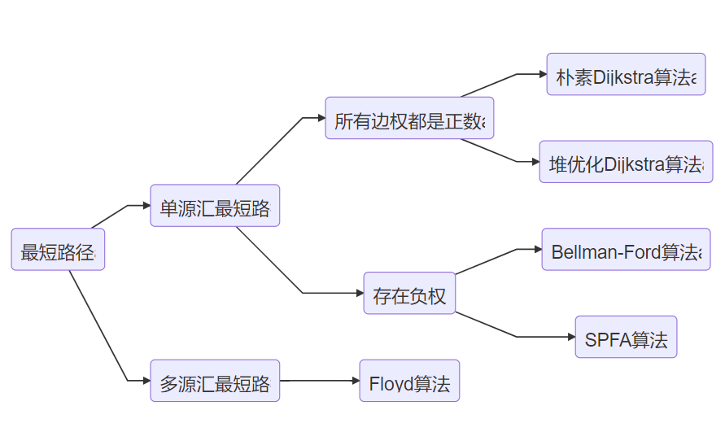
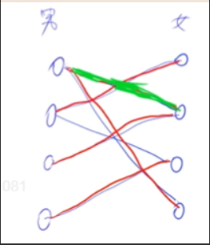

* [最短路径](#最短路径)
    * [单源汇最短路径](#单源汇最短路)
      * [朴素Dijkstra算法](#朴素dijkstra算法)
      * [堆优化Dijkstra算法](#堆优化dijkstra算法)
      * [Bellman-Ford算法](#bellman-ford算法)
      * [SPFA算法](#spfa算法)
    * [多源汇最短路径](#多源汇最短路)
      * [Ford算法](#ford算法)
      * [总结](#总结)
    * [最小生成树](#最小生成树)
    * [朴素版的Prim算法](#朴素版的prim算法)
    * [Kruskal算法](#kruskal算法)
    * [二分图](#二分图)
        * [染色法](#染色法)
        * [匈牙利算法](#匈牙利算法)
    * [总结](#总结-1)

# 最短路径

**思维导图**

**注：一般而言单源汇最短路径使用SPFA算法，当SPFA算法被卡时使用堆优化Dijkstra算法**

## 单源汇最短路

**描述**：求1号到n号最短路

**适用范围**：只有一个起点

| 算法               | 适用范围 | 边权值 | 复杂度(N:点数 M:边数) | 来源     |
| ------------------ | -------- | ------ | --------------------- | -------- |
| 朴素Dijkstra       | 稠密图   | +      | O(N^2)                | 贪心     |
| 堆优化Dijkstra算法 | 稀疏图   | +      | O(mlogn)              | 贪心     |
| Bellman_Ford算法   |          | -      | O(nm)                 | 离散数学 |
| SPFA优化队列       |          | -      | 一般O(m)，最坏O(nm)   |          |

### 朴素Dijkstra算法

**算法描述**

1. dis[st] = 0,其他dis[i] = +无穷
2. for(i : n) // S:当前已确定最短的点
   ​    将不在S中的最近的点t加入S
   ​    t -- > S
   ​    用t更新其他点的距离 dis[x] -> dis[t] + w

**核心代码**

~~~cpp
int n, m;
int g[N][N], dis[N];
bool st[N];

int dijkstra(){
    memset(dis, 0x3f, sizeof dis);		//把所有距离初始化为正无穷
    
    dis[1] = 0;		//起点记为0
    
    for(int i = 0; i < n; i ++){
        int t = -1;
        for(int j = 1; j <= n; j ++){//找到集合外距离最近的点t
            if(!st[j] &&(t == -1 || dis[t] > dis[j])){
                t = j;
            }
        }
        
        st[t] = true;//把t加到集合中去
        
        for(int j = 1; j <= n; j ++){//用t更新其他的点
            dis[j] = min(dis[j], dis[t] + g[t][j]);
        }
    }
    
    if(dis[n] == 0x3f3f3f3f) return -1;
    return dis[n];
}
~~~

### 堆优化Dijkstra算法

**算法描述**

每轮寻找最小的点可以用堆来实现 O(1)
堆中修改一个数时间复杂度  O(logn)
一共修改m次         O(mlogn)

堆的实现

1. 手写堆  可以修改
2. 优先队列 不支持修改，因此每次可以新写一个加入，问题冗余

**核心代码**

~~~cpp
typedef pair<int, int> PII;
int n, m;		//n点数，m边数
int h[N], w[N], ne[N], e[N], idx;		//邻接表
bool st[N];
int dis[N];

int dijkstra()
{
    memset(dis, 0x3f, sizeof dis);
    dis[0] = 1;
    priority_queue<PII, vector<PII>, greater<PII>> heap;
    
    heap.push({0, 1});//0为距离,1为起点
    
    while(heap.size())
    {
        PII k = heap.top();
        heap.pop();
        int ver = k.second, distance = k.first;
        if(st[ver]) continue;
        st[ver] = true;
        
        for(int i = h[ver]; i != -1; i = ne[i])//用当前点更新其他点
        {
            int j = e[i];
            if(dis[j] > distance + w[i]){
                dis[j] = distance + w[i];
                heap.push({dis[j], j});
            }
        }
    }
    if(dis[n] == 0x3f3f3f3f) return -1;
    else return dis[n];
}
~~~

### Bellman-Ford算法

**算法描述**
for n 次
​    备份
​    for 所有边 a,b,w
​      dis[b] = min(dis[b], dis[a] + w) //松弛操作

**核心代码**

~~~cpp
struct Edge {
    int a,b,w;
} e[M];//把每个边保存下来即可
int dist[N];
int back[N];//备份数组防止串联
int n, m, k;//k代表最短路径最多包涵k条边

int bellman_ford() {
    memset(dist, 0x3f, sizeof dist);
    dist[1] = 0;
    for (int i = 0; i < k; i++) {//k次循环
        memcpy(back, dist, sizeof dist);
        for (int j = 0; j < m; j++) {//遍历所有边
            int a = e[j].a, b = e[j].b, w = e[j].w;
            dist[b] = min(dist[b], back[a] + w);
            //使用backup:避免给a更新后立马更新b, 这样b一次性最短路径就多了两条边出来
        }
    }
    if (dist[n] > 0x3f3f3f3f / 2) return -1;
    else return dist[n];
}
~~~

### SPFA算法

**算法描述**

1. 首先：s——>queue

2. while(queue 不空)

   ① q.front()——>t

   ​		q.pop()

   ② 更新所有t的出边t  ---w--->b

   ​		b——>queue

**核心代码**

~~~c++
int n, m;		//n点数，m边数
int h[N], e[N], ne[N], w[N], cur;		//邻接表存储
int dis[N];		//dis存储从1~n的最短路径
bool st[N];		//判断是否在队列中

int spfa()
{
    memset(dis, 0x3f, sizeof dis);//初始化dis数组
    dis[1] = 0;
    
    st[1] = true;
    queue<int> q;
    q.push(1);
    
    while(q.size())
    {
        int t = q.front();
        q.pop();
        st[t] = false;
        
        for(int i = h[t]; i != -1; i = ne[i])
        {
            int j = e[i];
            if(dis[j] > dis[t] + w[i])
            {
                dis[j] = dis[t] + w[i];
                if(!st[j])//无需重复入队
                {
                    q.push(j);
                    st[j] = true;
                }
            }
        }
    }
    
    if(dis[n] == 0x3f3f3f3f) return -1;
    else return dis[n];  
}
~~~

**SPFA算法还能够来判断负权边**

抽屉原理

如果每个抽屉代表一个集合，每一个苹果就可以代表一个元素，假如有n+1个元素放到n个集合中去，其中必定有一个集合里至少有两个元素。” 抽屉原理有时也被称为鸽巢原理。 它是组合数学中一个重要的原理

**具体原理**

在更新dis的时候cnt[x]+1，如果在cnt[x]≥n，意味着1~x至少经过了n条边，那么一定有n+1个点，根据抽屉原理，那么至少有两个点的值是相同的。

**核心代码**

~~~cpp
int h[N], e[N], w[N], ne[N], idx;		//邻接表
int dist[N], cnt[N];		//各点到源点的距离
bool st[N];
int n,m;

int spfa(){
    queue<int> q;

    for(int i = 1; i <= n; i ++)		//新增  需要将所有点全都放进队列中
    {
        st[i] = true;
        q.push(i);
    }

    while (q.size()) {
        int t = q.front();
        q.pop();
        st[t] = false;

        for (int i = h[t]; i != -1; i = ne[i]) {
            int j = e[i];
            if (dist[j] > dist[t] + w[i]) {
                dist[j] = dist[t] + w[i];
                cnt[j] = cnt[t] + 1;//新增

                if(cnt[j] >= n) return true;//新增
                if (!st[j]) {
                    q.push(j);
                    st[j] = true;
                }
            }
        }
    }
    return false;
}
~~~

## 多源汇最短路

有许多不同的起点

| 算法     | 复杂度 | 来源 |
| -------- | ------ | ---- |
| Ford算法 | O(N^3) | DP   |

### Ford算法

**核心代码**

~~~cpp
void floyd()
{
    for (int k = 1; k <= n; k ++ )
        for (int i = 1; i <= n; i ++ )
            for (int j = 1; j <= n; j ++ )
                d[i][j] = min(d[i][j], d[i][k] + d[k][j]);
}
~~~

### 总结

用一句话总结：单源最短路优先使用SPFA，SPFA通不过使用堆优化Dijkstra，多源最短路径使用Ford。

## 最小生成树

1. Prim算法

2. kruskal算法

~~~mermaid
graph LR
A(最小生成树)-->B1(朴素Prim算法)
B1-->C1(稠密图)
A-->B2(Kruskal算法)
B2-->C2(稀疏图)
~~~

## 朴素版的Prim算法

**算法思路**（类似Dijkstra算法）

1. 把所有距离初始化为正无穷

2. for(int i = 0; i < n; i ++){//进行n此迭代

   2.1 找到集合外距离最近的点-->t

   2.2 用t更新其他点到集合的距离

   2.3 把t加到集合中去}

**核心代码**

~~~cpp
int prim()
{
    memset(dist, 0x3f, sizeof dist);        //把所有距离初始化为正无穷

    int res = 0;
    for (int i = 0; i < n; i ++ )       //进行n此迭代
    {
        int t = -1;
        for (int j = 1; j <= n; j ++ )      //找到集合外距离最近的点
            if (!st[j] && (t == -1 || dist[t] > dist[j]))
                t = j;

        if (i && dist[t] == INF) return INF;		//图不连通
        if (i) res += dist[t];

        for (int j = 1; j <= n; j ++ ) dist[j] = min(dist[j], g[t][j]);     //用t更新其他点到集合的距离
        
        st[t] = true;       //把t加到集合中
    }

    return res;
}
~~~

## Kruskal算法

**算法思路**

1. 将所有边按权重从小到大排序

2. 枚举每条边a,b,权重c

   if(a,b不连通)

   ​	将ab加入集合

**核心代码**

~~~cpp
int n, m;		//n点，m边
int p[N];		//存储并查集

struct Edge		//结构体存储
{
    int a, b, w;
    bool operator < (const Edge & W) const
    {
        return w < W.w;
    }
}edges[N];

int kruskal(){
    sort(edges, edges + m);		//将所有边从小到大排序
    
    for(int i = 1; i <= n; i ++) p[i] = i;//初始化并查集
    
    int res = 0, cnt = 0;
    for(int i = 0; i < m; i ++){
        int a = edges[i].a, b = edges[i].b, w= edges[i].w;
        
        a = find(a), b = find(b);
        if(a != b){		//a、b不连通，将a、b加入集合
            p[a] = b;
            res += w;
            cnt ++;
        }
    }
    
    if(cnt < n - 1) res INF;
    return res;
}
~~~

## 二分图

~~~mermaid
graph LR
A1(二分图)-->B1(染色法)
A1-->B2(匈牙利算法)
~~~

二分图：当且仅当图中不含奇数环

奇数环：点的数量为奇数

### 染色法

O(n+m)

**算法描述**

1. 从1~n遍历

   if(i未染色)

   ​	dfs(i,1)

**核心代码**

~~~cpp
bool dfs(int u, int c){
    color[u] = c;
    
    for(int i = h[u]; i != -1; i = ne[i]){//遍历
        int j = e[i];
        if(!color[j]){		//若未染色
            if(!dfs(j, 3-c)) return false;
        }
        else if(color[j] == c) return false;
    }
    return true;
}
~~~

### 匈牙利算法

O(nm)，一般远远小于O(nm)

**算法思路**

男生追女生，当女生有男友的时候，询问他男友能不能换一个对象，如果能换，则女生空出来，男生则可以和女生在一起。

**核心代码**

~~~cpp
int n1, n2;     // n1表示第一个集合中的点数，n2表示第二个集合中的点数
int h[N], e[M], ne[M], idx;     // 邻接表存储所有边，匈牙利算法中只会用到从第一个集合指向第二个集合的边，所以这里只用存一个方向的边
int match[N];       // 存储第二个集合中的每个点当前匹配的第一个集合中的点是哪个
bool st[N];     // 表示第二个集合中的每个点是否已经被遍历过

bool find(int x)
{
    for (int i = h[x]; i != -1; i = ne[i])
    {
        int j = e[i];
        if (!st[j])
        {
            st[j] = true;
            if (match[j] == 0 || find(match[j]))
            {
                match[j] = x;
                return true;
            }
        }
    }
    return false;
}

// 求最大匹配数，依次枚举第一个集合中的每个点能否匹配第二个集合中的点
int res = 0;
for (int i = 1; i <= n1; i ++ )
{
    memset(st, false, sizeof st);
    if (find(i)) res ++ ;
}
~~~

## 总结

图论难点

1. 建图困难
2. 70%~80%的同学不能写出模板

