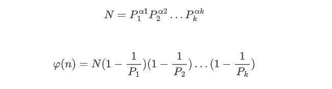
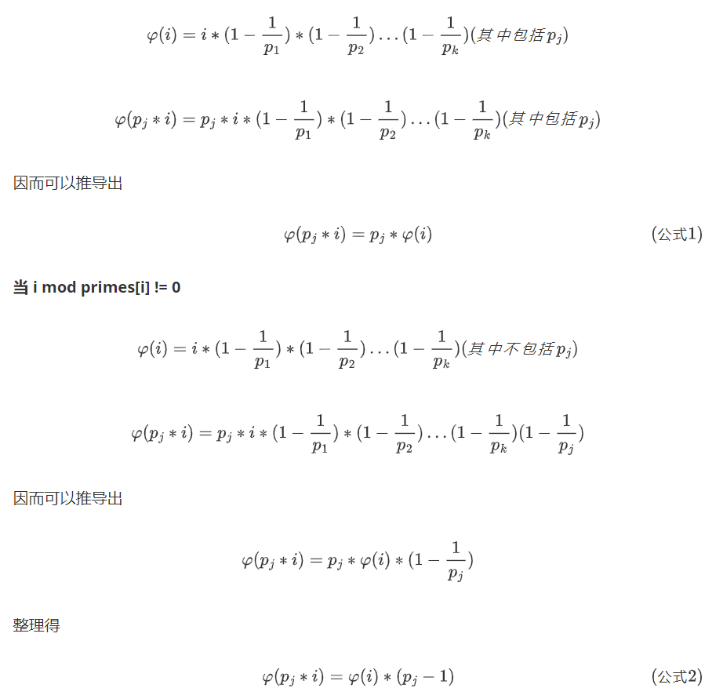
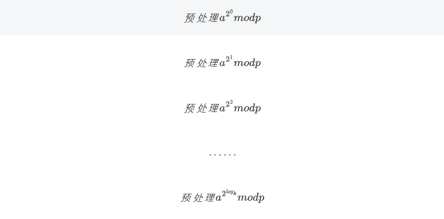

* [数学知识](#数学知识)
    * [数论](#数论)
        * [质数](#质数)
        * [约数](#约数)
        * [欧拉函数](#欧拉函数)
        * [快速幂](#快速幂)
        * [扩展欧几里得算法](#扩展欧几里得算法)
        * [中国剩余定理](#中国剩余定理)
    * [组合计数](#组合计数)
        * [卡特兰数](#卡特兰数)
    * [容斥原理](#容斥原理)
    * [高斯消元](#高斯消元)
    * [简单博弈论](#简单博弈论)
        * [NIM游戏](#nim游戏)
        * [SG函数](#sg函数)

# 数学知识

## 数论

### 质数

> 定义：在大于1的整数中，如果只包含1和本身这两个约数，就被称为质数，或者叫素数

**（1）质数的判定——试除法O(根号n)**

~~~cpp
bool is_prime(int x)
{
    if (x < 2) return false;
    for (int i = 2; i <= x / i; i ++ )
        if (x % i == 0)
            return false;
    return true;
}
~~~

**（2）分解质因数——试除法**

> 从小到大枚举所有数

~~~cpp
void divide(int x)
{
    for (int i = 2; i <= x / i; i ++ )
        if (x % i == 0)
        {
            int s = 0;
            while (x % i == 0) x /= i, s ++ ;
            cout << i << ' ' << s << endl;
        }
    if (x > 1) cout << x << ' ' << 1 << endl;
    cout << endl;
}
~~~

​	**（3）筛法求素数**

**朴素筛法**

~~~cpp
void get_primes(int n)
{
    for(int i = 2; i <= n; i ++)
    {
        if(!st[i])//当前数未被筛过——>质数
            prime[cnt ++] = n;
        //将他的倍数筛掉
        for(int j = i + i; j<= n; j += i) st[j] = true;
    }
}
~~~

**埃及筛法**

**思想，就是筛选p的时候只判断p能否被质数整除**

~~~cpp
void get_primes(int n)
{
    for(int i = 2; i <= n; i ++)
    {
        if(!st[i])//当前数未被筛过——>质数
        {
            primes[cnt ++] = n;
            for(int j = i + i; j <= n; j += i) st[j] = true;//只将质数的倍数筛掉
        }
	}
}
~~~

**线性筛法**

**核心：n只会被他的最小质因子筛掉**

1. i % pj == 0

   pj 一定是i的最小质因子，pj一定是pj * i的最小质因子

2. i % pj != 0

   pj 一定小于i的所有质因子

~~~cpp
int primes[N], cnt;     // primes[]存储所有素数
bool st[N];         // st[x]存储x是否被筛掉

void get_primes(int n)
{
    for (int i = 2; i <= n; i ++ )
    {
        if (!st[i]) primes[cnt ++ ] = i;
        for (int j = 0; primes[j] <= n / i; j ++ )
        {
            st[primes[j] * i] = true;
            if (i % primes[j] == 0) break;   
        }
    }
}
~~~

### 约数

(1)试除法求一个数所有的约数

~~~cpp
vector<int> get_divisors(int x)
{
    vector<int> res;
    for (int i = 1; i <= x / i; i ++ )
        if (x % i == 0)
        {
            res.push_back(i);
            if (i != x / i) res.push_back(x / i);
        }
    sort(res.begin(), res.end());
    return res;
}
~~~

**核心思想**：N=p1^c1∗p2^c2∗…∗pk^ck

(2)约数个数

> (a1+1)(a2+1)…(ak+1)

int范围内约数个数1500个左右

(3)约数之和

> (p1^0+p1^2+…+p1^a)…(pk^0+pk^2+…+pk^a)

秦九韶算法

~~~cpp
    for(auto prime : primes)
    {
        int p = prime.first, a = prime.second;
        LL t = 1;
        while(a --) t = (t * p + 1) % mod;
        res = res * t % mod;
    }
~~~

(4)欧几里得算法(辗转相除法)

~~~cpp
int gcd(int a, int b){
    return b ? gcd(b, a % b) : a;
}
~~~

### 欧拉函数

φ(n)：1~n中互质的数的个数

> 例如:n取6
>
> 1、2、3、4、5、6中1与6互质、5与6互质
>
> φ(6) = 2

公式推导

利用了**容斥原理**

1. 从1~N中去掉p1,p2,…,pk的所有倍数

2. 加上所有pi*pj的倍数

3. 减去所有三个数的倍数

4. 加上4个数的倍数

5. ……
   

**核心代码**

~~~cpp
int phi(int x)
{
    int res = x;
    for (int i = 2; i <= x / i; i ++ )
        if (x % i == 0)
        {
            res = res / i * (i - 1);
            while (x % i == 0) x /= i;
        }
    if (x > 1) res = res / x * (x - 1);

    return res;
}
~~~

#### 欧拉定理

> 若a与n互质

欧拉定理推论

#### 费马定理

> 若n为质数

#### 筛法求欧拉函数

求1~n每个数的欧拉函数

~~~cpp
int primes[N], cnt;     // primes[]存储所有素数
int euler[N];           // 存储每个数的欧拉函数
bool st[N];         // st[x]存储x是否被筛掉

void get_eulers(int n)
{
    phi[1] = 1;//enler[1]特殊处理为1
    for(int i = 2; i <= n ; i ++)
    {
        if(!st[i])
        {
            primes[cnt ++] = i;
            phi[i] = i - 1;//i为质数，互质的数有i-1个
        }
        for(int j = 0; primes[j] <= n / i; j ++)
        {
            st[primes[j] * i] = true;
            if(i % primes[j] == 0)//i % primes[i] == 0详见公式1
            {
                phi[primes[j] * i] = primes[j] * phi[i];
                break;
            }//i % primes[i] ！= 0 详见公式2
            phi[primes[i] * j] = phi[i] * (primes[j] - 1);
        }
    }
}
~~~

**当 i mod primes[i] == 0**

### 快速幂

用来求

核心思想：反复平方法

k拆成logk数中间的和

**核心代码**

~~~cpp
//求a^k % p
int qmi(int a, int k, int p)
{
    int res = 1;
    while(k)//进行k次
    {
        if(k & 1) res = (LL) res * a % p;//最初a^2^0
        k >>= 1;//删掉k的末尾
        a = (LL) a * a % p;
    }
    return res;
}
~~~

### 扩展欧几里得算法

**裴蜀定理**

> 对于任意正整数a,b,那么一定存在整数x,y，使得ax+by = (a, b)

~~~cpp
// 求x, y，使得ax + by = gcd(a, b)
int exgcd(int a, int b, int &x, int &y)
{
    if (!b)
    {
        x = 1; y = 0;
        return a;
    }
    int d = exgcd(b, a % b, y, x);
    y -= (a/b) * x;
    return d;
}
~~~

### 中国剩余定理

> m1,m2,…,mk两两互质

> x=a1(mod  m1)
>
> x=a2(mod  m2)
>
> ………………
>
> x=ak(mod  mk)

> M = m1m2…mk
>
> Mi = M / mi

**通解**(中国剩余定理)

使用扩展欧几里得算法求逆

## 组合计数

1. 10W组询问,1≤a,b≤2000	递推

~~~cpp
// c[a][b] 表示从a个苹果中选b个的方案数
for (int i = 0; i < N; i ++ )
    for (int j = 0; j <= i; j ++ )
        if (!j) c[i][j] = 1;
        else c[i][j] = (c[i - 1][j] + c[i - 1][j - 1]) % mod;
~~~

2. 1W组，1≤a,b≤1e5	预处理

~~~cpp
首先预处理出所有阶乘取模的余数fact[N]，以及所有阶乘取模的逆元infact[N]
如果取模的数是质数，可以用费马小定理求逆元
int qmi(int a, int k, int p)    // 快速幂模板
{
    int res = 1;
    while (k)
    {
        if (k & 1) res = (LL)res * a % p;
        a = (LL)a * a % p;
        k >>= 1;
    }
    return res;
}

// 预处理阶乘的余数和阶乘逆元的余数
fact[0] = infact[0] = 1;
for (int i = 1; i < N; i ++ )
{
    fact[i] = (LL)fact[i - 1] * i % mod;
    infact[i] = (LL)infact[i - 1] * qmi(i, mod - 2, mod) % mod;
}
~~~

3. 20组询问，1≤a,b≤1e18，1≤p≤1e5	卢卡斯定理

~~~cpp
int qmi(int a, int k)
{
    int res = 1;
    while(k)
    {
        if(k & 1) res= (LL)res * a % p;
        a = (LL)a * a % p;
        k >>= 1;
    }
    return res;
}

int C(int a, int b)
{
    int res = 1;
    for(int i = 1, j = a; i<= b; i ++, j --)
    {
        res = (LL)res * j % p;
        res = (LL)res * qmi(i, p - 2) % p;
    }
    return res;
}

int lucas(LL a, LL b)
{
    if(a < p && b < p) return C(a, b);
    return (LL)C(a % p, b % p) * lucas(a / p, b / p) % p;
}
~~~

4. 高精度

分解质因数

~~~cpp
/*当我们需要求出组合数的真实值，而非对某个数的余数时，分解质因数的方式比较好用：
    1. 筛法求出范围内的所有质数
    2. 通过 C(a, b) = a! / b! / (a - b)! 这个公式求出每个质因子的次数。 n! 中p的次数是 n / p + n / p^2 + n / p^3 + ...
    3. 用高精度乘法将所有质因子相乘
*/
int primes[N], cnt;     // 存储所有质数
int sum[N];     // 存储每个质数的次数
bool st[N];     // 存储每个数是否已被筛掉

void get_primes(int n)      // 线性筛法求素数
{
    for (int i = 2; i <= n; i ++ )
    {
        if (!st[i]) primes[cnt ++ ] = i;
        for (int j = 0; primes[j] <= n / i; j ++ )
        {
            st[primes[j] * i] = true;
            if (i % primes[j] == 0) break;
        }
    }
}

int get(int n, int p)       // 求n！中的次数
{
    int res = 0;
    while (n)
    {
        res += n / p;
        n /= p;
    }
    return res;
}

vector<int> mul(vector<int> a, int b)       // 高精度乘低精度模板
{
    vector<int> c;
    int t = 0;
    for (int i = 0; i < a.size(); i ++ )
    {
        t += a[i] * b;
        c.push_back(t % 10);
        t /= 10;
    }

    while (t)
    {
        c.push_back(t % 10);
        t /= 10;
    }

    return c;
}
~~~

### 卡特兰数

## 容斥原理

## 高斯消元

**算法步骤：**

1. 枚举每一列c

   1.1 找到当前一列绝对值最大的一行

   1.2 将该行换到最上面

   1.3 将该行第一个数变成1

   1.4 将下面所有行的当前列消成0

**核心代码**(模拟高斯消元算法步骤)

~~~cpp
int gauss()
{
    int c, r;//c列,r行
    for(c = 0, r = 0; c < n; c ++)
    {
        int t = r;
        for(int i = r; i < n; i ++)
            if(fabs(a[i][c]) > fabs(a[t][c]))
                t = i;
        //abs返回整数
        //fabs返回浮点数
        if(fabs(a[t][c]) < eps) continue;
        
        for(int i = c; i <= n; i ++) swap(a[t][i], a[r][i]);
        for(int i = n; i >= c; i --) a[r][i] /= a[r][c];
        for(int i = r + 1; i < n; i ++)
            if(fabs(a[i][c]) > eps)
                for(int j = n; j >= c; j --)
                    a[i][j] -= a[r][j] * a[i][c];
                    
        r ++;
    }
    if(r < n)
    {
        for(int i = r; i < n; i ++)
            if(fabs(a[i][c]) > eps)
                return 2;
        return 1;
    }
    
    for(int i = n - 1; i >= 0; i --)
        for(int j = i + 1; j < n; j ++)
            a[i][n] -= a[i][j] * a[j][n];
    
    return 0;//有唯一解
}
~~~

## 简单博弈论

### NIM游戏

给定N堆物品，第i堆物品有Ai个。两名玩家轮流行动，每次可以任选一堆，取走任意多个物品，可把一堆取光，但不能不取。取走最后一件物品者获胜。两人都采取最优策略，问先手是否必胜。

我们把这种游戏称为NIM博弈。把游戏过程中面临的状态称为局面。整局游戏第一个行动的称为先手，第二个行动的称为后手。若在某一局面下无论采取何种行动，都会输掉游戏，则称该局面必败。
所谓采取最优策略是指，若在某一局面下存在某种行动，使得行动后对面面临必败局面，则优先采取该行动。同时，这样的局面被称为必胜。我们讨论的博弈问题一般都只考虑理想情况，即两人均无失误，都采取最优策略行动时游戏的结果。
NIM博弈不存在平局，只有先手必胜和先手必败两种情况。

定理： NIM博弈先手必胜，当且仅当 A1 ^ A2 ^ … ^ An != 0

### SG函数

在有向图游戏中，对于每个节点x，设从x出发共有k条有向边，分别到达节点y1, y2, …, yk，定义SG(x)为x的后继节点y1, y2, …, yk 的SG函数值构成的集合再执行mex(S)运算的结果，即：
SG(x) = mex({SG(y1), SG(y2), …, SG(yk)})
特别地，整个有向图游戏G的SG函数值被定义为有向图游戏起点s的SG函数值，即SG(G) = SG(s)。

**定理**
有向图游戏的某个局面必胜，当且仅当该局面对应节点的SG函数值大于0。
有向图游戏的某个局面必败，当且仅当该局面对应节点的SG函数值等于0。

