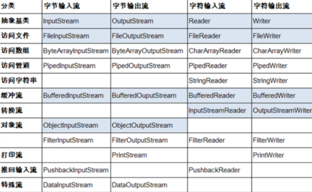
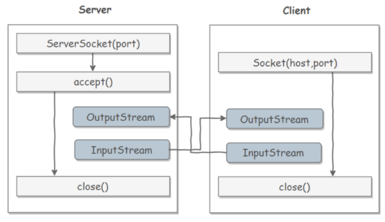

* [JavaIO](#java-io)
    * [一、File操作](#一file操作)
    * [二、字节操作](#二字节操作)
      * [文件复制](#文件复制)
      * [装饰者模式](#装饰者模式)
    * [三、字符操作](#三字符操作)
      * [编码与解码](#编码与解码)
      * [String的编码方式](#string的编码方式)
      * [Reader 与 Writer](#reader-与-writer)
      * [实现逐行输出文本文件的内容](#实现逐行输出文本文件的内容)
    * [四、对象操作](#四对象操作)
      * [序列化](#序列化)
      * [Serializable](#serializable)
      * [transient](#transient)
    * [五、网络编程](#五网络编程)
      * [InetAddress](#inetaddress)
      * [URL](#url)
      * [Sockets](#sockets)
      * [TCP网络编程](#tcp网络编程)
      * [Datagram](#datagram)
      * [UDP网络编程](#udp网络编程)

# Java I/O

Java的I/O大概可以分为以下几类：

* 磁盘操作：File
* 字节操作：InputStream和OutputStream
* 字符操作：Reader和Writer
* 对象操作：Serializable
* 网络操作：Socket



## 一、File操作

File类可以用于表示文件和目录，但是它不表示文件的内容。

递归地列出一个目录下所有文件：

~~~java
public static void listAllFiles(File dir) {
    if (dir == null || !dir.exists()) {
        return;
    }
    if (dir.isFile()) {
        System.out.println(dir.getName());
        return;
    }
    for (File file : dir.listFiles()) {
        listAllFiles(file);
    }
}
~~~

从Java7开始，可以使用Paths和Files代替File。


## 二、字节操作

### 文件复制

~~~java
public static void copyFile(String src, String dist) throws IOException {
    FileInputStream in = new FileInputStream(src);
    FileOutputStream out = new FileOutputStream(dist);

    byte[] buffer = new byte[20 * 1024];
    int cnt;
	
    // read() 最多读取 buffer.length 个字节
    // 返回的是实际读取的个数
    // 返回 -1 的时候表示读到 eof，即文件尾
    while ((cnt = in.read(buffer, 0, buffer.length)) != -1) {
        out.write(buffer, 0, cnt);
    }

    in.close();
    out.close();
}
~~~

### 装饰者模式

Java I/O 使用了装饰者模式来实现。以 InputStream 为例，

- InputStream 是抽象组件；
- FileInputStream 是 InputStream 的子类，属于具体组件，提供了字节流的输入操作；
- FilterInputStream 属于抽象装饰者，装饰者用于装饰组件，为组件提供额外的功能。例如 BufferedInputStream 为 FileInputStream 提供缓存的功能。

[](https://camo.githubusercontent.com/bd677933d5dedcbe5587f249814e4181ca14b9cbbfeb0d79ed8a40a6c4097170/68747470733a2f2f63732d6e6f7465732d313235363130393739362e636f732e61702d6775616e677a686f752e6d7971636c6f75642e636f6d2f39373039363934622d646230352d346363652d386432662d3163386230396634643932312e706e67)


实例化一个具有缓存功能的字节流对象时，只需要在 FileInputStream 对象上再套一层 BufferedInputStream 对象即可。

```
FileInputStream fileInputStream = new FileInputStream(filePath);
BufferedInputStream bufferedInputStream = new BufferedInputStream(fileInputStream);
```

DataInputStream 装饰者提供了对更多数据类型进行输入的操作，比如 int、double 等基本类型。

## 三、字符操作


### 编码与解码

**编码**

> 字符---->>字节

**解码**

> 字节---->>字符

编码和解码的过程使用不同的编码方式那么久出现了乱码。

* GBK编码中，中文字符占2个字节，英文字符占1个字节
* UTF-8 编码中，中文字符占 3 个字节，英文字符占 1 个字节；
* UTF-16be 编码中，中文字符和英文字符都占 2 个字节。

Java 的内存编码使用双字节编码 UTF-16be，这不是指 Java 只支持这一种编码方式，而是说 char 这种类型使用 UTF-16be 进行编码。char 类型占 16 位，也就是两个字节，Java 使用这种双字节编码是为了让一个中文或者一个英文都能使用一个 char 来存储。


### String的编码方式

String 可以看成一个字符序列，可以指定一个编码方式将它编码为字节序列，也可以指定一个编码方式将一个字节序列解码为 String。

```java
String str1 = "中文";
byte[] bytes = str1.getBytes("UTF-8");//编码
String str2 = new String(bytes, "UTF-8");//解码
System.out.println(str2);
```


### Reader 与 Writer

不管是磁盘还是网络传输，最小的存储单元都是字节，而不是字符。但是在程序中操作的通常是字符形式的数据，因此需要提供对字符进行操作的方法。

- InputStreamReader 实现从字节流解码成字符流；
- OutputStreamWriter 实现字符流编码成为字节流。


### 实现逐行输出文本文件的内容

```java
public static void readFileContent(String filePath) throws IOException {

    FileReader fileReader = new FileReader(filePath);
    BufferedReader bufferedReader = new BufferedReader(fileReader);

    String line;
    while ((line = bufferedReader.readLine()) != null) {
        System.out.println(line);
    }

    // 装饰者模式使得 BufferedReader 组合了一个 Reader 对象
    // 在调用 BufferedReader 的 close() 方法时会去调用 Reader 的 close() 方法
    // 因此只要一个 close() 调用即可
    bufferedReader.close();
}
```

## 四、对象操作


### 序列化

序列化就是将一个对象转换成字节序列，方便存储和传输。

- 序列化：ObjectOutputStream.writeObject()
- 反序列化：ObjectInputStream.readObject()

不会对静态变量进行序列化，因为序列化只是保存对象的状态，静态变量属于类的状态。


### Serializable

序列化的类需要实现 Serializable 接口，它只是一个标准，没有任何方法需要实现，但是如果不去实现它的话而进行序列化，会抛出异常。


### transient

transient 关键字可以使一些属性不会被序列化。

ArrayList 中存储数据的数组 elementData 是用 transient 修饰的，因为这个数组是动态扩展的，并不是所有的空间都被使用，因此就不需要所有的内容都被序列化。通过重写序列化和反序列化方法，使得可以只序列化数组中有内容的那部分数据。

```java
private transient Object[] elementData;
```


## 五、网络编程

Java 中的网络支持：

- InetAddress：用于表示网络上的硬件资源，即 IP 地址；
- URL：统一资源定位符；
- Sockets：使用 TCP 协议实现网络通信；
- Datagram：使用 UDP 协议实现网络通信。


### InetAddress

用来获取ip

没有公有的构造函数，只能通过静态方法来创建实例。

```java
InetAddress.getByName(String host);
InetAddress.getByAddress(byte[] address);
InetAddress.getLocalHost();
```


### URL

可以直接从 URL 中读取字节流数据。

```java
public static void main(String[] args) throws IOException {

    URL url = new URL("http://www.baidu.com");

    /* 字节流 */
    InputStream is = url.openStream();

    /* 字符流 */
    InputStreamReader isr = new InputStreamReader(is, "utf-8");

    /* 提供缓存功能 */
    BufferedReader br = new BufferedReader(isr);

    String line;
    while ((line = br.readLine()) != null) {
        System.out.println(line);
    }

    br.close();
}
```


### Sockets

- ServerSocket：服务器端类
- Socket：客户端类
- 服务器和客户端通过 InputStream 和 OutputStream 进行输入输出。



### TCP网络编程

* **客户端**

~~~java
//1. 创建Socket对象，指明服务端的ip和端口号
InetAddress inet = InetAddress.getByName("127.0.0.1");
Socket socket = new Socket(inet, 8899);
//2. 获取一个输出流，用于输出数据
OutputStream os = socket.getOutputStream();
//3. 写出数据操作
os.write("你好，我是客户端mm".getBytes());
//资源的关闭
os.close();
socket.close();
~~~

* **服务端**

~~~java
//1. 创建服务器端ServerSocket，指明自己的端口号
ServerSocket ss = new ServerSocket(8899);
//2. 调用accept()表示接受来自于客户端的socket
Socket socket = ss.accept();
//3. 获取一个输入流
InputStream is = socket.getInputStream();

//读入输入流的数据
ByteArrayOutputStream baos = new ByteArrayOutputStream();
//byte数组的拼接
byte[] buffer = new byte[5];
int len;
while((len = is.read(buffer)) != -1){
    baos.write(buffer, 0, len);
}
System.out.println(baos.toString());

//资源的关闭
baos.close();
is.close();
socket.close();
ss.close();
~~~


### Datagram

- DatagramSocket：通信类
- DatagramPacket：数据包类


### UDP网络编程

* 客户端

  ~~~java
  public void sender() throws IOException {
      
      DatagramSocket socket = new DatagramSocket();
  
      String str = "我是UDP方式发送的导弹";
      byte[] data = str.getBytes();
      InetAddress inet = InetAddress.getByName("127.0.0.1");
      DatagramPacket packet = new DatagramPacket(data,0,data.length,inet,9090);
  
      socket.send(packet);
      socket.close();
  }
  ~~~

* 服务端

  ~~~java
  public void receiver() throws IOException {
      
      DatagramSocket socket = new DatagramSocket(9090);
  
      byte[] buffer = new byte[100];
      DatagramPacket packet = new DatagramPacket(buffer,0,buffer.length);
  
      socket.receive(packet);
  
      System.out.println(new String(packet.getData(),0, packet.getLength()));
  
      socket.close();
  }
  ~~~

  

  