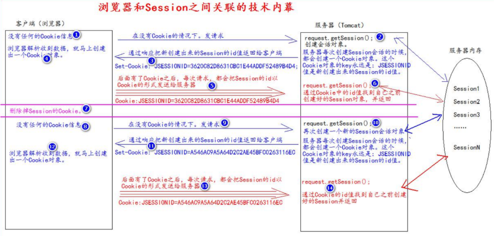

* [一、Cookie](#一cookie)
    * [1.什么是Cookie](#1什么是cookie)
    * [2.如何创建Cookie](#2如何创建cookie)
    * [3.服务器如何获取Cookie](#3服务器如何获取cookie)
    * [4.Cookie值的修改](#4cookie值的修改)
    * [5.生命控制](#5生命控制)
    * [6.Cookie有效路径Path的设置](#6cookie有效路径path的设置)
* [二、Session](#二session)
    * [1.什么是Session会话？](#1什么是session会话)
    * [2.如何创建Session和获取](#2如何创建session和获取)
    * [3.Session域数据的存取](#3session域数据的存取)
    * [4.Session生命周期控制](#4session生命周期控制)
    * [5.浏览器和Session之间关联的技术内幕](#5浏览器和session之间关联的技术内幕)

# 一、Cookie

## 1.什么是Cookie

1. Cookie翻译过来是饼干的意思。
2. Cookie是服务器通知客户端保存键值对的一种技术
3. 客户端有了Cookie后，每次请求都发送给服务器。
4. 每个Cookie的大小不能超过4kb

## 2.如何创建Cookie

~~~java
protected void createCookie(HttpServletRequest req, HttpServletResponse resp) throws ServletException, IOException {
    //1. 创建Cookie对象
    Cookie cookie = new Cookie("key", "value");
    //2. 通知客户端保存Cookie
    resp.addCookie(cookie);
}
~~~

## 3.服务器如何获取Cookie

~~~java
request.getCookies();//返回Cookie[]数组。
~~~

## 4.Cookie值的修改

**方案一：**

1. 先创建一个要修改的同名的Cookie对象
2. 在构造器，同时赋予新的Cookie值。
3. 调用response.addCookie(Cookie);

~~~java
Cookie cookie = new Cookie("key", "newValue");
resp.addCookie(cookie);
~~~

**方案二：**

1. 先查找到需要修改的 Cookie 对象 
2. 调用 setValue()方法赋于新的 Cookie 值。 
3. 调用 response.addCookie()通知客户端保存修改。

~~~java
Cookie cookie = CookieUtils.fundCookid("key",req.getCookies());
if(cookie != null){
    cookie.setValue("newValue2");
    resp.addCookie(cookie);
}
~~~

## 5.生命控制

Cookie的声明控制指的是如何管理Cookie什么时候被销毁(删除)

setMaxAge()

> 正数，表示在指定的秒数后过期
>
> 负数，表示浏览器一关，Cookie就会被删除（默认值-1）
>
> 零，表示马上删除Cookie

~~~java
protected void life3600(HttpServletRequest req, HttpServletResponse resp) throws ServletException, IOException { 
    Cookie cookie = new Cookie("life3600", "life3600");
    cookie.setMaxAge(60 * 60); // 设置 Cookie 一小时之后被删除。无效 
    resp.addCookie(cookie);
    resp.getWriter().write("已经创建了一个存活一小时的 Cookie"); }
~~~

## 6.Cookie有效路径Path的设置

Cookie 的 path 属性可以有效的过滤哪些 Cookie 可以发送给服务器。哪些不发。 path 属性是通过请求的地址来进行有效的过滤。 

例如：

> CookieA 			path=/工程路径 
>
> CookieB 			path=/工程路径/abc

请求地址如下：

> http://ip:port/工程路径/a.html
>
> CookieA发送
>
> CookieB不发生
>
> http://ip:port/工程路径/abc/a.html
>
> CookieA发送
>
> CookieB发生

# 二、Session

## 1.什么是Session会话？

1. Session 就一个接口（HttpSession）。 
2. Session 就是会话。它是用来维护一个客户端和服务器之间关联的一种技术。 
3. 每个客户端都有自己的一个 Session 会话。 
4. Session 会话中，我们经常用来保存用户登录之后的信息

## 2.如何创建Session和获取

request.getSession()

> 第一次调用是：创建Session会话
>
> 之后调用都是：获取前面创建好的Session会话对象

isNew()：判断到底是不是刚创建出来的（新的）

> true		表示刚创建
>
> false		表示获取之前创建

每个会话都有一个身份证号。也就是ID值。而且这个ID是唯一的。

getId()得到Session的会话id值。

## 3.Session域数据的存取

~~~java
//存
req.getSession().setAttribute("key1", "value1");
//取
Object attribute = req.getSession().getAttribute("key1");
~~~

## 4.Session生命周期控制

public void setMaxinactiveInterval(int interval)设置Session的超时时间（以秒为单位），超过指定时间就会被销毁。

> 值为正数的时候，设定Session的超时时长
>
> 负数表示永不超时（极少使用）

public int getMaxinactiveInterval()获取Seesion的超时时长

public void invalidate()让当前Session会话马上超时无效

**Session默认的超时时长是多少？**

30分钟

## 5.浏览器和Session之间关联的技术内幕

