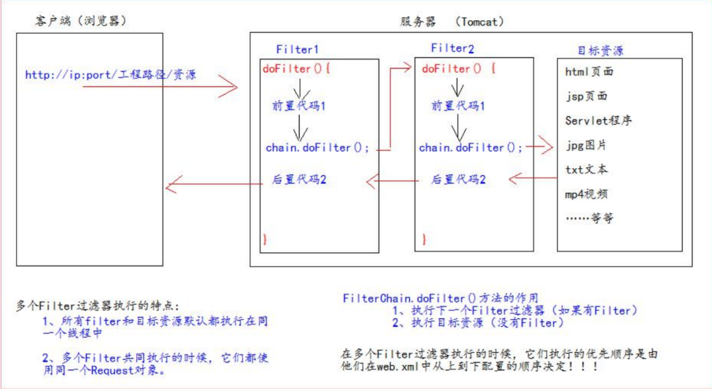

* [一、Filter过滤器](#一filter过滤器)
   * [1.介绍](#1介绍)
   * [2.Filter的初体验](#2filter的初体验)
   * [3.Filter的生命周期](#3filter的生命周期)
   * [4.FilterConfig类](#4filterconfig类)
   * [5.FilterChain过滤器链](#5filterchain过滤器链)
   * [6.Filter的拦截路径](#6filter的拦截路径)

# 一、Filter过滤器

## 1.介绍

**什么是Filter过滤器**

1. Filter 过滤器它是 JavaWeb 的三大组件之一。三大组件分别是：Servlet 程序、Listener 监听器、Filter 过滤器 
2. Filter 过滤器它是 JavaEE 的规范。也就是接口 
3. Filter 过滤器它的作用是：**拦截请求**，过滤响应。 

**拦截请求常见的应用场景有**

1. 权限检查
2. 日记操作 
3. 事务管理 
4. ……

## 2.Filter的初体验

在web工程下，管理员权限必须要用户登录后才能访问。登录后信息保存到Session域中，所以检查用户是否登陆，可以判断Session中是否包含用户登录的信息。

~~~xml
<%
   Object user = session.getAttribute("user");
   if(user == null){
   		request.getRequestDispatcher("/login.jsp").forward(request, response);
   		return;
   }
%>
~~~

Filter代码

~~~java
public class AdminFilter implements Filter {
    @Override
    public void doFilter(ServletRequest servletRequest, ServletResponse servletResponse, FilterChain filterChain) throws IOException, ServletException {
        HttpServletRequest httpServletRequest = (HttpServletRequest) servletRequest;
        HttpSession session = httpServletRequest.getSession();
        Object user = session.getAttribute("user");
        // 如果等于 null，说明还没有登录 
        if (user == null) {
  servletRequest.getRequestDispatcher("/login.jsp").forward(servletRequest,servletResponse);
            return;
        }else{
            // 让程序继续往下访问用户的目标资源
            filterChain.doFilter(servletRequest,servletResponse);
        }
    }
}
~~~

web.xml 中的配置

~~~xml
<filter>
    <filter-name>AdminFilter</filter-name>
    <filter-class>com.atguigu.filter.AdminFilter</filter-class>
</filter>
<filter-mapping>
    <filter-name>AdminFilter</filter-name>
    <url-pattern>/admin/*</url-pattern>
</filter-mapping>
~~~

**Filter 过滤器的使用步骤：** 

1. 编写一个类去实现 Filter 接口 
2. 实现过滤方法 doFilter() 
3. 到 web.xml 中去配置 Filter 的拦截路径

## 3.Filter的生命周期

Filter 的生命周期包含几个方法 

1. 构造器方法 

2. init 初始化方法 

   > 第 1，2 步，在 web 工程启动的时候执行（Filter 已经创建） 

3. doFilter 过滤方法

   > 第 3 步，每次拦截到请求，就会执行 

4. destroy 销毁

   > 第 4 步，停止 web 工程的时候，就会执行（停止 web 工程，也会销毁 Filter 过滤器）

## 4.FilterConfig类

FilterConfig 类见名知义，它是 Filter 过滤器的配置文件类。 Tomcat 每次创建 Filter 的时候，也会同时创建一个 FilterConfig 类，这里包含了 Filter 配置文件的配置信息。

FilterConfig 类的作用是获取 filter 过滤器的配置内容 

1. 获取 Filter 的名称 filter-name 的内容 
2. 获取在 Filter 中配置的 init-param 初始化参数 
3. 获取 ServletContext 对象 

## 5.FilterChain过滤器链

| Filter      | 过滤器   |
| ----------- | -------- |
| Chain       | 链，链条 |
| FilterChain | 过滤器链 |

## 6.Filter的拦截路径

1. 精确匹配

   > <url-pattern>/target.jsp</url-pattern>
   >
   > 以上配置的路径，表示请求地址必须为：http://ip:port/工程路径/target.jsp 

2. 目录匹配

   > <url-pattern>/admin/*</url-pattern> 
   >
   > 以上配置的路径，表示请求地址必须为：http://ip:port/工程路径/admin/*

3. 后缀名匹配

   > <url-pattern>*.html</url-pattern> 
   >
   > 以上配置的路径，表示请求地址必须以.html 结尾才会拦截到