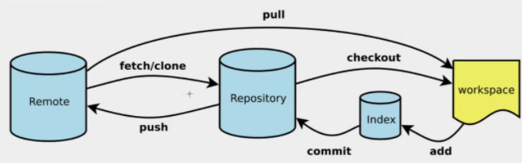

* [Git的工作原理](#git的工作原理)
* [Git项目的搭建](#git项目的搭建)
* [Git的基本操作](#git的基本操作)
* [Git忽略文件](#git忽略文件)
* [SSH公钥免密登陆](#ssh公钥免密登陆)

## Git的工作原理

## Git项目的搭建

**方式一**：本地初始化

~~~
$ git init
~~~

**方式二**：克隆远程仓库

~~~
$ git clone[url]
~~~

## Git的基本操作

查看文件状态

~~~
git status [filename]
~~~

查看所有文件状态

~~~
git status
~~~

添加所有文件到暂存区

~~~
git add .
~~~

提交文件至暂存区

~~~
git commit -m"描述信息"
~~~

## Git忽略文件

有时候不需要将所有文件提在主目录下交仓库：例如：设计文件等。

在主目录下有`.gitignore`文件。此文件可以忽略一些文件内容，具体规则如下：

1. 忽略文件中的空格或以井号(#)开始的内容
2. 可以使用Linux通配符。
3. 如果名称的前面有一个感叹号(!),表示将不被忽略
4. 如果名称的最前面是一个路径分隔符(/)，表示要忽略的文件在此目录下，而子目录文件将不被忽略。
5. 如果名称的最后面是一个路径分隔符(/)，表示忽略的是此目录下的文件。

## SSH公钥免密登陆

1. 找到C/用户/Administrator/.ssh的文件，删除其中的内容

2. 输入命令

   > $ ssh-keygen -t rsa

   -t rsa是加密方式

   生成公钥后将公钥黏贴到SSH公钥处